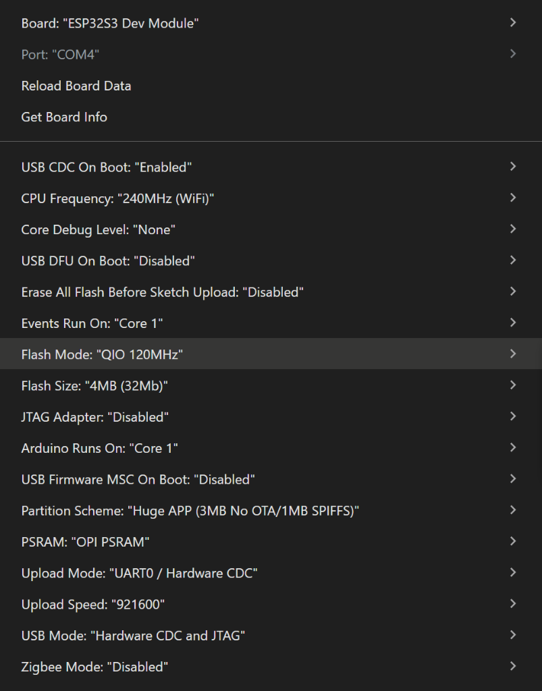

# BEEhavior – TinyAIoT Smart Hive 

## Projektübersicht

BEEhavior erkennt und zählt Hummeln am Stockeingang in Echtzeit mithilfe eines YOLO-Modells (Edge Impulse), das direkt auf einem ESP32-S3 läuft. Ein Tracking-Algorithmus verfolgt die Hummeln über Frames hinweg und zählt Ein-/Ausflüge über zwei virtuelle Zähllinien. Die Zählerstände werden automatisch an [openSenseMap](https://opensensemap.org) übertragen und zusammen mit Umweltdaten (Temperatur, UV, Luftfeuchte) in einem Web-Dashboard visualisiert.


**Kernfunktionen:**
- **On-Device Inferenz** – YOLO Object Detection direkt auf dem ESP32-S3
- **Hummelzählung** – Tracking + Zähler-Logik
- **Umweltsensoren** – Temperatur, Luftfeuchte und UV-Intensität über senseBox
- **openSenseMap-Upload** – Automatische Synchronisierung der Zähler und Sensoren per HTTPS
- **Web-Dashboard** – Live-Visualisierung aller Daten

---

## Repository-Struktur

```
├── Dashboard/
│   └── Dashboard.html                     ← Web-Dashboard (openSenseMap Live-Daten)
├── Datensätze/
│   ├── EdgeImpulse_Trainingsdaten.zip     ← Gelabelte Edge Impulse Trainingsdaten
│   ├── HummelBilder.zip                   ← Rohbilder 
│   └── HummelBilder_2.zip                 ← Rohbilder 
├── Halterung/
│   └── Halterung.stl                      ← 3D-Druck-Datei für die Kamerahalterung
├── Modell/
│   └── HummelEdgeImpulse_inferencing.zip  ← Edge Impulse Modell (Arduino Library)
├── Sketches/
│   ├── FinalSketch.ino                    ← Hauptsketch (Inferenz, Stream, Zählung, Upload etc.)
│   ├── BeeSensoren.ino                    ← Sketch für die Sensoren
│   └── BilderAufnehmenESP.ino             ← Hilfssketch: Trainingsbilder auf SD-Karte aufnehmen
├── docs/
│   └── arduino_board_settings.png         ← Screenshot der Arduino Board-Einstellungen
├── LICENSE                                ← MIT Lizenz
└── README.md                          
```

---

## Deployment Guide

### Hardware

- **ESP32-S3 senseBox Eye** mit RGB-Kamera und WiFi-Antenne
- **Temperatur, Luftfeuchtesensor, UV-Sensor** (senseBox)
- **3D-gedruckte Halterung** für stabile Zählung am Stockeingang
- **Powerbank** ggf. zur Stromversorgung

### Software

Voraussetzungen:

- Arduino IDE installieren
- Board-Paket **esp32 by Espressif Systems** in Arduino IDE installieren

### Schritt 1 – Modell importieren

`Modell/HummelEdgeImpulse_inferencing.zip` in Arduino IDE importieren:  
*Sketch → Bibliothek einbinden → .ZIP-Bibliothek hinzufügen…*

### Schritt 2 – Sketch anpassen

Im `FinalSketch.ino` müssen die **WLAN-Zugangsdaten** angepasst werden. 
Optional können der **Startbestand** an Hummeln im Stock und ggf. Parameter wie der **Confidence-Threshold** etc. angepasst werden.

### Schritt 3 – Board-Einstellungen

Mit diesen Tool-Einstellungen lief der Sketch bei uns auf dem ESP32-S3, können aber ggf. auch angepasst werden.



### Schritt 4 – Upload & Start

1. ESP32-S3 per USB verbinden
2. Während man den Boot-Knopf hält, den einmal Reset-Knopf drücken
3. Upload klicken
4. Seriellen Monitor öffnen
5. Reset-Knopf erneut drücken
6. IP im Browser öffnen → Livebild mit Zählern

---
### Hinweis

Das Livebild dient hauptsächlich Überprüfungs- und Debugzwecken. Für den eigentlichen Betrieb empfehlen wir es zu deaktivieren, da es zu Leistungseinbußen auf dem ESP führt und die Frame-Rate der Erkennung reduziert.
In unserem Projekt haben wir mit Hummeln gearbeitet. Das Ganze kann aber auch auf z.B. Bienen übertragen werden - dementsprechend sollte dann ein neues Modell trainiert werden.

## Dashboard

`Dashboard/Dashboard.html` einfach im Browser öffnen, zeigt Live-Daten aus openSenseMap:

- **Dashboard-Tab:** Ein-/Ausflüge, Bestand, UV, Temperatur, Luftfeuchte + stündliches Aktivitätschart
- **Standort-Tab:** Leaflet-Karte mit GPS-Position der senseBox
- **Recap-Tab:** 7-Tage-Durchschnittswerte + Wochenchart

---

## Lizenz

Dieses Projekt ist im Rahmen eines TinyAIoT-Studienprojekts entstanden und steht unter der [MIT License](LICENSE).

